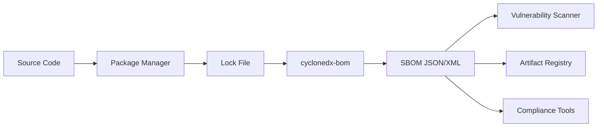

# Python Security & Supply Chain Best Practices Report (2024-2025)

**Research Date:** November 2025 **Scope:** pyproject.toml security, SBOM
generation, vulnerability management, supply chain protection

---

## Table of Contents

1. [Executive Summary](#executive-summary)
2. [Recommended Security Scanning Tools](#1-recommended-security-scanning-tools)
3. [SBOM Generation Process](#2-sbom-generation-process)
4. [Vulnerability Monitoring Setup](#3-vulnerability-monitoring-setup)
5. [Supply Chain Attack Mitigations](#4-supply-chain-attack-mitigations)
6. [Package Verification Methods](#5-package-verification-methods)
7. [Security Metadata Recommendations](#6-security-metadata-recommendations)
8. [Code Examples & Tool Configurations](#7-code-examples--tool-configurations)
9. [References & Standards](#8-references--standards)

---

## Executive Summary

### 2024-2025 Threat Landscape

**Critical Statistics:**

- **512,847+ malicious packages** discovered across ecosystems (Nov 2023-2024) -
  **156% increase YoY**
- **PyPI projected 530 billion requests** by end of 2024 (87% growth YoY)
- **1,300% increase** in malicious packages over 3 years
- **December 2024:** Ultralytics YOLO package compromised via GitHub Actions +
  PyPI API token

**Key Takeaway:** Python supply chain security is no longer optional - it's
critical infrastructure.

### Major Developments (2024)

1. **PEP 740 (Nov 2024):** PyPI now supports digital attestations via Sigstore +
   Trusted Publishing
2. **PEP 710:** Recording provenance of installed packages in
   `.dist-info/provenance_url.json`
3. **OSV Database:** CPython vulnerabilities now published to Open Source
   Vulnerability Database
4. **SLSA Framework:** Supply-chain Levels for Software Artifacts gaining
   adoption

---

## 1. Recommended Security Scanning Tools

### 1.1 Tool Comparison Matrix

| Tool          | Type  | Cost                | Database                    | Python Support | CI/CD | Strengths                                    |
| ------------- | ----- | ------------------- | --------------------------- | -------------- | ----- | -------------------------------------------- |
| **pip-audit** | SCA   | Free                | PyPI Advisory DB (OSV)      | Excellent      | ✅    | Open source, auto-fix, official PyPA         |
| **Safety**    | SCA   | Paid (Free limited) | Safety DB (monthly updates) | Excellent      | ✅    | Commercial support, 500K+ malicious packages |
| **Trivy**     | Multi | Free                | Multiple sources            | Excellent      | ✅    | Containers, IaC, secrets, misconfigs         |
| **Grype**     | SCA   | Free                | Multi-source (OSV, etc)     | Excellent      | ✅    | SBOM+VEX support, fast scans                 |
| **Bandit**    | SAST  | Free                | N/A (code analysis)         | Excellent      | ✅    | Code security issues, AST-based              |
| **Snyk**      | Multi | Paid (Free tier)    | Snyk DB                     | Excellent      | ✅    | Great UX, fix PRs, IDE integration           |

### 1.2 Tool Selection Guide

**For Open Source Projects:**

```bash
# Recommended stack (100% free)
pip-audit    # Dependency vulnerabilities
bandit       # Code security issues
trivy        # Container scanning
cyclonedx-py # SBOM generation
```

**For Commercial Projects:**

```bash
# Recommended stack (paid + free)
safety       # Dependency vulnerabilities (better DB)
bandit       # Code security issues
snyk         # Developer-friendly, IDE integration
trivy        # Container + IaC scanning
```

**For High-Security Environments:**

```bash
# Defense in depth (multiple tools)
pip-audit + safety  # Dual vulnerability scanning
bandit + semgrep    # Dual SAST scanning
trivy + grype       # Dual container scanning
```

### 1.3 Detailed Tool Analysis

#### pip-audit (Recommended for Most Projects)

**Pros:**

- ✅ Official PyPA tool (Trail of Bits, funded by Google)
- ✅ Free and open source (Apache 2.0)
- ✅ Uses PyPI JSON API + OSV database (transparent, up-to-date)
- ✅ Auto-fix capabilities: `pip-audit --fix`
- ✅ Multiple input formats: requirements.txt, pyproject.toml, environment

**Cons:**

- ❌ No commercial support
- ❌ Dependency-only (no code analysis)

**Best For:** Open source projects, CI/CD pipelines, automated security checks

#### Safety (Commercial Alternative)

**Pros:**

- ✅ Comprehensive database (500K+ malicious packages)
- ✅ Commercial support and SLAs
- ✅ Safety CLI 3 with advanced features
- ✅ Integration with CI/CD and development workflows

**Cons:**

- ❌ Not free for commercial use
- ❌ Safety DB only updated monthly (free tier)
- ❌ No auto-fix without paid plan

**Best For:** Commercial projects requiring support, teams needing SLAs

#### Trivy (Container & Multi-Purpose)

**Pros:**

- ✅ Comprehensive: vulnerabilities, secrets, misconfigurations, IaC
- ✅ Fast scans optimized for CI/CD
- ✅ Multiple target types: images, filesystems, git repos, Kubernetes
- ✅ SBOM generation built-in (CycloneDX, SPDX)
- ✅ Supports requirements.txt, Pipenv, Poetry lock files

**Cons:**

- ❌ Broader scope = more complex configuration
- ❌ Container-focused (overkill for Python-only projects)

**Best For:** Containerized applications, multi-language projects, DevSecOps
teams

#### Bandit (Code Security)

**Pros:**

- ✅ SAST tool analyzing Python source code via AST
- ✅ Detects common security issues (SQL injection, hardcoded secrets, etc.)
- ✅ Configurable severity levels and exclusions
- ✅ Fast, lightweight

**Cons:**

- ❌ Code-only (doesn't scan dependencies)
- ❌ False positives require tuning

**Best For:** All Python projects (complement to dependency scanners)

---

## 2. SBOM Generation Process

### 2.1 What is an SBOM?

**Software Bill of Materials (SBOM):** A comprehensive inventory of all
components, libraries, and dependencies in a software application, including:

- Package names and versions
- License information
- Dependency relationships
- Source provenance
- Security vulnerability data

**Why SBOMs Matter (2024):**

- Required by US Executive Order 14028 for government software
- Enables rapid vulnerability response (e.g., Log4Shell incident)
- Supply chain transparency and compliance
- Facilitates security audits and license compliance

### 2.2 SBOM Format Standards

| Format        | Organization     | Focus                                    | Adoption      |
| ------------- | ---------------- | ---------------------------------------- | ------------- |
| **CycloneDX** | OWASP            | Security-focused, vulnerability tracking | High (Python) |
| **SPDX**      | Linux Foundation | License compliance, provenance           | Medium        |
| **SWID**      | ISO/IEC          | Asset management, inventory              | Low           |

**Recommendation:** Use **CycloneDX** for Python projects (best tooling,
security focus)

### 2.3 Recommended SBOM Tools

#### cyclonedx-bom (Primary Recommendation)

**Why cyclonedx-bom is best:**

> "Probably the most accurate, complete SBOM generator for any python-related
> projects"

**Supported Formats:**

- pip (requirements.txt, pip freeze)
- Poetry (pyproject.toml + poetry.lock)
- Pipenv (Pipfile.lock)
- PDM (pyproject.toml + pdm.lock)
- Python environments (site-packages)

**Installation:**

```bash
pip install cyclonedx-bom
```

**Usage:**

```bash
# From requirements.txt
cyclonedx-py requirements requirements.txt -o sbom.json

# From Poetry project
cyclonedx-py poetry -o sbom.json

# From current environment
cyclonedx-py environment -o sbom.json

# Generate XML format
cyclonedx-py requirements requirements.txt -o sbom.xml --format xml
```

#### Alternative: Syft (Multi-Language)

**Best for:** Multi-language projects, Docker images

```bash
# Install
curl -sSfL https://raw.githubusercontent.com/anchore/syft/main/install.sh | sh -s -- -b /usr/local/bin

# Generate SBOM
syft dir:/path/to/python/project -o cyclonedx-json > sbom.json
syft docker:myapp:latest -o spdx-json > sbom.json

# Scan Docker image
syft myapp:latest -o cyclonedx-json
```

#### lib4sbom (Format Conversion)

**Best for:** Converting between CycloneDX and SPDX

```bash
pip install lib4sbom

# Convert CycloneDX to SPDX
lib4sbom convert --input-file sbom-cyclonedx.json --output-file sbom-spdx.json --format spdx

# Validate SBOM
lib4sbom validate --input-file sbom.json --format cyclonedx
```

### 2.4 SBOM Generation Workflow



### 2.5 SBOM in CI/CD

**GitHub Actions Example:**

```yaml
name: Generate SBOM

on: [push, pull_request]

jobs:
  sbom:
    runs-on: ubuntu-latest
    steps:
      - uses: actions/checkout@v4

      - name: Set up Python
        uses: actions/setup-python@v5
        with:
          python-version: '3.11'

      - name: Install dependencies
        run: |
          pip install cyclonedx-bom
          pip install -r requirements.txt

      - name: Generate SBOM
        run: |
          cyclonedx-py requirements requirements.txt \
            -o sbom-cyclonedx.json \
            --format json

      - name: Upload SBOM artifact
        uses: actions/upload-artifact@v4
        with:
          name: sbom
          path: sbom-cyclonedx.json

      - name: Scan SBOM for vulnerabilities
        run: |
          pip install pip-audit
          pip-audit --requirement requirements.txt --format json
```

**GitLab CI Example:**

```yaml
sbom_generation:
  stage: security
  image: python:3.11
  script:
    - pip install cyclonedx-bom
    - cyclonedx-py requirements requirements.txt -o sbom.json
  artifacts:
    reports:
      cyclonedx: sbom.json
    paths:
      - sbom.json
    expire_in: 1 week
```

---

## 3. Vulnerability Monitoring Setup

### 3.1 Vulnerability Database Landscape

| Database             | Provider   | Update Frequency                 | Coverage           | API Access          |
| -------------------- | ---------- | -------------------------------- | ------------------ | ------------------- |
| **OSV**              | Google     | Real-time                        | Multi-ecosystem    | Free, public        |
| **PyPI Advisory DB** | PyPA       | Daily                            | Python only        | Free (via OSV)      |
| **Safety DB**        | Safety CLI | Monthly (free), Real-time (paid) | Python + malicious | Paid for commercial |
| **Snyk DB**          | Snyk       | Real-time                        | Multi-ecosystem    | Paid                |
| **GitHub Advisory**  | GitHub     | Real-time                        | Multi-ecosystem    | Free (GraphQL API)  |

**Recommendation:** Use **OSV (Open Source Vulnerabilities)** as primary
source - it's free, open, real-time, and aggregates multiple sources including
PyPI Advisory DB.

### 3.2 OSV Database Integration

**What is OSV?**

- Open source vulnerability database started by Google
- Aggregates data from 20+ sources (PyPI, npm, Maven, Go, Rust, etc.)
- Machine-readable format (JSON)
- RESTful API for querying

**CPython vulnerabilities are now published to OSV** (2024), meaning you can
query Python interpreter vulnerabilities alongside package vulnerabilities.

**OSV API Example:**

```python
import requests

def check_vulnerabilities(package: str, version: str, ecosystem: str = "PyPI"):
    """Query OSV API for vulnerabilities."""
    url = "https://api.osv.dev/v1/query"
    payload = {
        "package": {
            "name": package,
            "ecosystem": ecosystem
        },
        "version": version
    }
    response = requests.post(url, json=payload)

    if response.status_code == 200:
        data = response.json()
        vulns = data.get("vulns", [])
        return vulns
    return []

# Example usage
vulns = check_vulnerabilities("requests", "2.25.0")
for vuln in vulns:
    print(f"Vulnerability: {vuln['id']}")
    print(f"Summary: {vuln['summary']}")
    print(f"Severity: {vuln.get('severity', 'N/A')}")
```

**OSV CLI Tool:**

```bash
# Install osv-scanner
go install github.com/google/osv-scanner/cmd/osv-scanner@v1

# Scan project
osv-scanner --lockfile=requirements.txt

# Scan with SBOM
osv-scanner --sbom=sbom.json

# Output JSON
osv-scanner --lockfile=requirements.txt --format json > vulnerabilities.json
```

### 3.3 pip-audit Setup

**Installation:**

```bash
pip install pip-audit
```

**Basic Usage:**

```bash
# Audit installed packages
pip-audit

# Audit requirements.txt
pip-audit -r requirements.txt

# Audit with auto-fix (dry-run)
pip-audit -r requirements.txt --fix --dry-run

# Auto-fix vulnerabilities
pip-audit -r requirements.txt --fix

# Output formats
pip-audit --format json
pip-audit --format cyclonedx-json > sbom.json
pip-audit --format cyclonedx-xml > sbom.xml
```

**Advanced Configuration:**

```bash
# Ignore specific vulnerabilities (use sparingly!)
pip-audit --ignore-vuln PYSEC-2022-123

# Skip packages
pip-audit --skip-editable

# Require hashes (best practice)
pip-audit -r requirements.txt --require-hashes

# Set vulnerability service
pip-audit --vulnerability-service osv  # Default
pip-audit --vulnerability-service pypi  # PyPI JSON API
```

**pip-audit in CI/CD:**

```yaml
# .github/workflows/security.yml
name: Security Audit

on:
  push:
    branches: [main]
  pull_request:
  schedule:
    - cron: '0 0 * * *' # Daily at midnight

jobs:
  audit:
    runs-on: ubuntu-latest
    steps:
      - uses: actions/checkout@v4

      - uses: actions/setup-python@v5
        with:
          python-version: '3.11'

      - name: Install pip-audit
        run: pip install pip-audit

      - name: Audit dependencies
        run: pip-audit -r requirements.txt --format json
        continue-on-error: false # Fail build on vulnerabilities

      - name: Upload results
        if: failure()
        uses: actions/upload-artifact@v4
        with:
          name: pip-audit-results
          path: audit-results.json
```

### 3.4 Safety CLI Setup

**Installation:**

```bash
pip install safety
```

**Basic Usage:**

```bash
# Scan installed packages
safety check

# Scan requirements.txt
safety check -r requirements.txt

# Output JSON
safety check --json

# Full report
safety check --full-report
```

**Safety with Paid Plan:**

```bash
# Authenticate (requires Safety API key)
export SAFETY_API_KEY=your-api-key

# Scan with commercial database
safety check --key $SAFETY_API_KEY

# Policy file for organization-wide rules
safety check --policy-file .safety-policy.yml
```

**Safety Policy Example (`.safety-policy.yml`):**

```yaml
security:
  ignore-cvss-severity-below: 7 # Medium and above
  ignore-cvss-unknown-severity: false

  ignore-vulnerabilities:
    # Temporary exemptions (use sparingly!)
    # - PYSEC-2022-123  # Reason: Not exploitable in our use case

  continue-on-vulnerability-error: false # Fail on vulnerabilities

alert:
  security:
    enabled: true
    recipients:
      - security@example.com
```

### 3.5 Automated Dependency Updates

#### Dependabot vs Renovate

**For Python Security: Use BOTH (complementary approach)**

| Aspect               | Dependabot                   | Renovate                         |
| -------------------- | ---------------------------- | -------------------------------- |
| **Security Alerts**  | ✅ Native GitHub integration | ✅ Integrates with GitHub alerts |
| **Speed**            | Fast (native)                | Slightly slower                  |
| **Platforms**        | GitHub only                  | GitHub, GitLab, Bitbucket, Azure |
| **Customization**    | Limited                      | Extensive                        |
| **Monorepo Support** | Basic                        | Excellent (grouped PRs)          |
| **Cost**             | Free                         | Free (open source)               |

**Recommended Setup:**

1. **Dependabot:** Security alerts + security updates only
2. **Renovate:** Regular dependency updates with intelligent grouping

#### Dependabot Configuration

**Setup (GitHub Settings only - NO .yml file):**

1. Repository Settings → Security & analysis
2. ✅ Enable: Dependency graph
3. ✅ Enable: Dependabot alerts
4. ✅ Enable: Dependabot security updates
5. ❌ Disable: Dependabot version updates (Renovate handles this)

**Why this approach?**

- Dependabot security alerts are fastest (native GitHub integration)
- Renovate handles regular updates with better monorepo support
- Avoids duplicate PRs

#### Renovate Configuration

**renovate.json:**

```json
{
  "$schema": "https://docs.renovatebot.com/renovate-schema.json",
  "extends": ["config:base"],
  "prConcurrentLimit": 3,
  "prHourlyLimit": 2,
  "enabledManagers": ["pip_requirements", "pip_setup", "poetry", "pipenv"],

  "packageRules": [
    {
      "description": "Automerge non-major updates",
      "matchUpdateTypes": ["minor", "patch", "pin", "digest"],
      "automerge": true
    },
    {
      "description": "Group Python security updates",
      "matchDatasources": ["pypi"],
      "matchUpdateTypes": ["patch"],
      "labels": ["security", "dependencies"],
      "groupName": "Python security updates"
    },
    {
      "description": "Prioritize security vulnerabilities",
      "matchPackagePatterns": ["*"],
      "vulnerabilityAlerts": {
        "labels": ["security", "vulnerability"],
        "prPriority": 10
      }
    }
  ],

  "pip_requirements": {
    "fileMatch": ["(^|/)requirements.*\\.txt$"]
  },

  "lockFileMaintenance": {
    "enabled": true,
    "schedule": ["before 4am on monday"]
  }
}
```

### 3.6 Pre-commit Hooks for Security

**Install pre-commit:**

```bash
pip install pre-commit
```

**.pre-commit-config.yaml:**

```yaml
repos:
  - repo: https://github.com/PyCQA/bandit
    rev: '1.7.10'
    hooks:
      - id: bandit
        args: ['-ll', '--skip', 'B101,B601']

  - repo: local
    hooks:
      - id: pip-audit
        name: pip-audit
        entry: pip-audit
        language: system
        pass_filenames: false
        args: ['-r', 'requirements.txt']

  - repo: https://github.com/python-poetry/poetry
    rev: '1.8.0'
    hooks:
      - id: poetry-check
      - id: poetry-lock
        args: ['--check']

  - repo: https://github.com/pre-commit/pre-commit-hooks
    rev: v5.0.0
    hooks:
      - id: detect-private-key
      - id: check-yaml
      - id: end-of-file-fixer
      - id: trailing-whitespace
```

**Install hooks:**

```bash
pre-commit install
pre-commit install --hook-type commit-msg
```

**Run manually:**

```bash
# Run all hooks
pre-commit run --all-files

# Run specific hook
pre-commit run bandit --all-files
```

---

## 4. Supply Chain Attack Mitigations

### 4.1 Attack Vectors & Mitigations

| Attack Vector               | Description                                                            | Mitigation                                           |
| --------------------------- | ---------------------------------------------------------------------- | ---------------------------------------------------- |
| **Typosquatting**           | Malicious packages with similar names (e.g., `reqeusts` vs `requests`) | Verify spelling, use lock files, enable alerts       |
| **Dependency Confusion**    | Internal package names hijacked on public PyPI                         | Use private package indexes, namespace packages      |
| **Compromised Accounts**    | Attacker gains access to maintainer account                            | Enable 2FA, use Trusted Publishing, monitor releases |
| **Malicious Updates**       | Legitimate package compromised via update                              | Pin versions, use lock files, review diffs           |
| **Build System Compromise** | CI/CD secrets stolen (e.g., Ultralytics 2024)                          | Trusted Publishing, ephemeral tokens, audit logs     |
| **Transitive Dependencies** | Vulnerabilities in indirect dependencies                               | Scan entire dependency tree, use SBOM                |

### 4.2 Recommended Mitigations

#### 1. Use Lock Files (CRITICAL)

**Why:** Ensures reproducible builds and prevents unexpected dependency updates.

**Poetry (Recommended):**

```toml
# pyproject.toml
[tool.poetry.dependencies]
python = "^3.11"
requests = "^2.31.0"  # Allows patch updates

[tool.poetry.dev-dependencies]
pytest = "^8.0.0"
```

```bash
# Generate lock file
poetry lock

# Install from lock file
poetry install --no-root

# Update specific package
poetry update requests

# Update all packages
poetry update
```

**pip + requirements.txt:**

```bash
# Generate pinned requirements
pip freeze > requirements.txt

# Better: Use pip-compile (pip-tools)
pip install pip-tools
pip-compile requirements.in -o requirements.txt

# With hashes (most secure)
pip-compile --generate-hashes requirements.in -o requirements.txt
```

**Example with hashes:**

```text
# requirements.txt (generated by pip-compile --generate-hashes)
certifi==2024.8.30 \
    --hash=sha256:922820b53db7a7257ffbda3f597266d435245903d80737e34f8a45ff3e3230d8 \
    --hash=sha256:bec941d2aa8195e248a60b31ff9f0558284cf01a52591ceda73ea9afffd69fd9
requests==2.31.0 \
    --hash=sha256:942c5a758f98d2333389ec0d7b2c4e8d8c0c1f0f7c9e5d7f5f9e9e3e0e0e0e0e \
    --hash=sha256:58cd2187c01e70e6e26505bca751777aa9f2ee0b7f4300988b709f44e013003f
```

**Install with hash verification:**

```bash
pip install --require-hashes -r requirements.txt
```

#### 2. Use Private Package Indexes

**Why:** Prevents dependency confusion attacks (internal package names on public
PyPI).

**PEP 708: Extending the Repository API to Mitigate Dependency Confusion
Attacks**

**Option 1: PyPI Mirror (devpi)**

```bash
# Install devpi
pip install devpi-server devpi-client

# Start server
devpi-init
devpi-server --start

# Configure client
devpi use http://localhost:3141
devpi login root --password=''
devpi index -c dev bases=root/pypi
```

**pip configuration:**

```ini
# ~/.config/pip/pip.conf
[global]
index-url = http://localhost:3141/root/dev/+simple/
extra-index-url = https://pypi.org/simple
trusted-host = localhost
```

**Option 2: Artifactory / Nexus**

```bash
# pip.conf
[global]
index-url = https://artifactory.example.com/artifactory/api/pypi/pypi-virtual/simple
```

**Option 3: AWS CodeArtifact**

```bash
aws codeartifact login --tool pip --domain my-domain --repository my-repo

# Automatically updates pip.conf
```

#### 3. Enable 2FA for PyPI

**Why:** Prevents account takeover attacks.

**Setup:**

1. Login to PyPI: https://pypi.org/account/login/
2. Account Settings → Two Factor Authentication
3. Choose method: TOTP app (recommended) or WebAuthn/security key
4. Save recovery codes securely

**After 2FA is enabled:**

- API tokens required for publishing (username/password disabled)
- Use Trusted Publishing (no tokens needed)

#### 4. Use Trusted Publishing (STRONGLY RECOMMENDED)

**What is Trusted Publishing?**

- PyPI feature allowing package publishing via OIDC (no long-lived API tokens)
- GitHub Actions, GitLab CI, Google Cloud Build supported
- Tokens are short-lived and automatically rotated
- **Prevents token theft attacks** (e.g., Ultralytics 2024)

**Setup for GitHub Actions:**

1. PyPI project settings → Publishing → Add trusted publisher
2. Fill in:
   - GitHub owner: `your-username`
   - Repository: `your-repo`
   - Workflow: `publish.yml`
   - Environment: `release` (optional but recommended)

3. Update GitHub Actions workflow:

```yaml
# .github/workflows/publish.yml
name: Publish to PyPI

on:
  release:
    types: [published]

jobs:
  publish:
    name: Publish to PyPI
    runs-on: ubuntu-latest
    environment: release # Match PyPI trusted publisher config

    permissions:
      id-token: write # REQUIRED for trusted publishing
      contents: read

    steps:
      - uses: actions/checkout@v4

      - uses: actions/setup-python@v5
        with:
          python-version: '3.11'

      - name: Build package
        run: |
          pip install build
          python -m build

      - name: Publish to PyPI
        uses: pypa/gh-action-pypi-publish@release/v1
        # No API token needed! OIDC handles authentication
```

**Benefits:**

- ✅ No API tokens to leak
- ✅ Automatic rotation
- ✅ Audit trail (linked to GitHub identity)
- ✅ **Includes build provenance by default** (PEP 740)

#### 5. Verify Package Provenance (NEW in 2024)

**PEP 740: Digital Attestations**

If a package uses Trusted Publishing with
`pypa/gh-action-pypi-publish@v1.11.0+`, it automatically generates attestations.

**Verify attestations manually:**

```bash
# Install sigstore
pip install sigstore

# Download package
pip download requests==2.31.0 --no-deps

# Verify attestation (if available)
python -m sigstore verify identity \
  requests-2.31.0-py3-none-any.whl \
  --bundle requests-2.31.0-py3-none-any.whl.sigstore \
  --cert-identity https://github.com/psf/requests/.github/workflows/publish.yml \
  --cert-oidc-issuer https://token.actions.githubusercontent.com
```

**Programmatic verification:**

```python
import requests
from packaging.utils import parse_wheel_filename

def check_attestations(package: str, version: str):
    """Check if package has PyPI attestations."""
    url = f"https://pypi.org/simple/{package}/"
    response = requests.get(url)

    # Look for .sigstore files in package releases
    if ".sigstore" in response.text:
        print(f"✅ {package} {version} has attestations")
        return True
    else:
        print(f"❌ {package} {version} has NO attestations")
        return False

# Example
check_attestations("requests", "2.31.0")
```

**Query PyPI Integrity API (PEP 740):**

```bash
# Get attestations for a specific file
curl https://pypi.org/simple/requests/2.31.0/files/requests-2.31.0-py3-none-any.whl/attestations
```

#### 6. Dependency Pinning Strategy

**The Dilemma:**

- **Too strict:** Security vulnerabilities can't be patched (dangerous)
- **Too loose:** Unexpected breaking changes (unstable)

**Recommendation for Applications:**

```toml
# pyproject.toml (applications)
[tool.poetry.dependencies]
python = "^3.11"
requests = "~2.31.0"  # Allow patch updates only (~= 2.31.0, >= 2.31.0, < 2.32.0)
flask = "^3.0.0"      # Allow minor updates (>= 3.0.0, < 4.0.0)

# Security-critical: Pin exactly
cryptography = "42.0.8"  # Exact version
```

**Recommendation for Libraries:**

```toml
# pyproject.toml (libraries)
[tool.poetry.dependencies]
python = "^3.11"
requests = ">=2.28.0"  # Broad range, no upper bound

# AVOID upper bounds unless PROVEN incompatibility
# flask = "^3.0.0"  # ❌ BAD for libraries
# flask = ">=3.0.0"  # ✅ GOOD for libraries
```

**Why no upper bounds for libraries?**

- Prevents dependency hell when multiple libraries conflict
- Allows users to patch security vulnerabilities
- Libraries should be tested against wide version ranges

**Research Finding (2024):**

> "Bound version constraints (upper caps) are causing real world problems in the
> Python ecosystem. Upper limits cause far more harm than good even for true
> SemVer libraries." — iscinumpy.dev (May 2024)

**Exception:** Pin upper bounds if specific incompatibility is known and
documented.

#### 7. Monitor Package Health

**Use tools to assess package quality before adoption:**

**Scorecard (OpenSSF):**

```bash
# Install
go install github.com/ossf/scorecard/v4/cmd/scorecard@latest

# Check package GitHub repo
scorecard --repo=github.com/psf/requests

# Output JSON
scorecard --repo=github.com/psf/requests --format json > scorecard.json
```

**Scorecard checks:**

- Security policy
- Code review
- CI tests
- Dependency updates
- SAST tools
- Signed releases
- Branch protection

**Socket.dev (Supply Chain Analysis):**

```bash
# Install
npm install -g @socketsecurity/cli

# Scan Python dependencies
socket report create --view package.json requirements.txt
```

**Snyk Advisor:**

Visit: https://snyk.io/advisor/python/[package-name]

Example: https://snyk.io/advisor/python/requests

Shows:

- Health score
- Maintenance status
- Security vulnerabilities
- Community engagement
- License

---

## 5. Package Verification Methods

### 5.1 Verification Hierarchy

```
🔒 Strongest
├─ Digital Attestations (PEP 740, Sigstore) ⭐ NEW 2024
├─ Sigstore signatures
├─ PGP signatures (deprecated on PyPI)
├─ Hash verification (pip --require-hashes)
└─ TLS (HTTPS) ⬅️ Baseline (default)
🔓 Weakest
```

### 5.2 Hash Verification

**Generate hashes:**

```bash
# Using pip-compile
pip install pip-tools
pip-compile --generate-hashes requirements.in -o requirements.txt

# Using hashin
pip install hashin
hashin requests==2.31.0 >> requirements.txt
```

**Install with hash verification:**

```bash
pip install --require-hashes -r requirements.txt
```

**Example requirements.txt:**

```text
requests==2.31.0 \
    --hash=sha256:942c5a758f98d235013e08dddd3f5f7c9e5d7f7c9e5d7f5f9e9e3e0e0e0e0e0e \
    --hash=sha256:58cd2187c01e70e6e26505bca751777aa9f2ee0b7f4300988b709f44e013003f
urllib3==2.0.7 \
    --hash=sha256:c97dfde1f7bd43a71c8d2a58e369e9b2bf692d1334ea9f9cae55add7d0dd0f84 \
    --hash=sha256:8d22f7fc9e2b1c6fbebf3390f3f22a4c5e11ac6de7d9c5c7f3d1c06c8d8d84a0
```

### 5.3 Sigstore Verification

**What is Sigstore?**

- Modern signing infrastructure (no PGP key management)
- Uses short-lived certificates from OpenID Connect (OIDC)
- Transparency log (Rekor) for auditability
- Python 3.14 will use Sigstore as the only signing method

**Verify Python releases:**

```bash
# Install sigstore-python
pip install sigstore

# Download Python source + signature
wget https://www.python.org/ftp/python/3.11.0/Python-3.11.0.tar.xz
wget https://www.python.org/ftp/python/3.11.0/Python-3.11.0.tar.xz.sig

# Verify with sigstore
python -m sigstore verify identity \
  Python-3.11.0.tar.xz \
  --bundle Python-3.11.0.tar.xz.sig \
  --cert-identity noreply@python.org \
  --cert-oidc-issuer https://accounts.google.com
```

**Verify PyPI packages with attestations:**

```bash
# Install package verification tool
pip install pypi-attestations

# Check if package has attestations
pypi-attestations verify requests 2.31.0

# Download and verify
pip download requests==2.31.0 --no-deps
pypi-attestations verify requests-2.31.0-py3-none-any.whl
```

### 5.4 SLSA Provenance Verification

**What is SLSA?**

- Supply-chain Levels for Software Artifacts
- Framework for ensuring software integrity
- 4 levels (0-3), with Level 3 being "resistant to most supply-chain attacks"

**SLSA Levels:**

| Level | Requirements            | Example                           |
| ----- | ----------------------- | --------------------------------- |
| **0** | No guarantees           | Manual build                      |
| **1** | Build documented        | GitHub Actions without provenance |
| **2** | Signed provenance       | GitHub Actions with provenance    |
| **3** | Hardened build platform | Sigstore + Trusted Publishing     |

**Verify SLSA provenance:**

```bash
# Install slsa-verifier
go install github.com/slsa-framework/slsa-verifier/v2/cli/slsa-verifier@latest

# Verify GitHub release artifact
slsa-verifier verify-artifact \
  --provenance-path attestation.jsonl \
  --source-uri github.com/your-org/your-repo \
  artifact.tar.gz
```

**Python + SLSA:**

Most Python packages don't yet generate SLSA provenance, but PyPI's Trusted
Publishing + PEP 740 attestations are moving towards SLSA Level 2-3.

### 5.5 Automated Verification in CI/CD

**GitHub Actions:**

```yaml
name: Verify Dependencies

on: [pull_request]

jobs:
  verify:
    runs-on: ubuntu-latest
    steps:
      - uses: actions/checkout@v4

      - uses: actions/setup-python@v5
        with:
          python-version: '3.11'

      - name: Install with hash verification
        run: |
          pip install --require-hashes -r requirements.txt

      - name: Check for attestations
        run: |
          pip install pypi-attestations
          for package in $(pip freeze | cut -d'=' -f1); do
            pypi-attestations verify $package || echo "⚠️ No attestations for $package"
          done
```

---

## 6. Security Metadata Recommendations

### 6.1 pyproject.toml Security Enhancements

**Add security metadata to your `pyproject.toml`:**

```toml
[project]
name = "my-secure-package"
version = "1.0.0"
description = "A secure Python package"
readme = "README.md"
license = {text = "MIT"}
requires-python = ">=3.11"
authors = [
    {name = "Your Name", email = "you@example.com"}
]
keywords = ["security", "example"]
classifiers = [
    "Development Status :: 4 - Beta",
    "Intended Audience :: Developers",
    "License :: OSI Approved :: MIT License",
    "Programming Language :: Python :: 3",
    "Programming Language :: Python :: 3.11",
    "Programming Language :: Python :: 3.12",
    "Topic :: Security",
]

# Security metadata
[project.urls]
Homepage = "https://github.com/your-org/your-repo"
Documentation = "https://your-docs.com"
Repository = "https://github.com/your-org/your-repo"
Changelog = "https://github.com/your-org/your-repo/blob/main/CHANGELOG.md"
"Bug Tracker" = "https://github.com/your-org/your-repo/issues"
"Security Policy" = "https://github.com/your-org/your-repo/security/policy"  # ⭐ Important!

[project.optional-dependencies]
# Security tools for development
security = [
    "pip-audit>=2.7.0",
    "bandit[toml]>=1.7.0",
    "safety>=3.0.0",
]

[tool.bandit]
# Bandit configuration
exclude_dirs = ["tests", "venv", ".venv"]
tests = ["B201", "B301", "B302", "B303", "B304", "B305", "B306", "B307"]
skips = ["B101", "B601"]  # Skip assert_used and paramiko

[tool.bandit.assert_used]
skips = ["*/test_*.py", "*/tests/*.py"]

[tool.pip-audit]
# pip-audit configuration (if supported in future)
ignore-vulnerabilities = []  # List CVEs to ignore (use sparingly)
```

### 6.2 SECURITY.md Template

**Create `SECURITY.md` in your repository root:**

```markdown
# Security Policy

## Supported Versions

We release patches for security vulnerabilities. Which versions are eligible for
receiving such patches depends on the CVSS v3.0 Rating:

| Version | Supported          |
| ------- | ------------------ |
| 1.0.x   | :white_check_mark: |
| < 1.0   | :x:                |

## Reporting a Vulnerability

**DO NOT** open a public issue. Security vulnerabilities should be reported
privately.

### GitHub Security Advisories (Recommended)

1. Go to https://github.com/your-org/your-repo/security/advisories
2. Click "Report a vulnerability"
3. Fill in the details

### Email

Send details to security@example.com with:

- Description of the vulnerability
- Steps to reproduce
- Potential impact
- Suggested fix (if any)

### Response Timeline

- **Acknowledgment:** Within 48 hours
- **Initial Assessment:** Within 1 week
- **Fix & Disclosure:** Within 90 days (coordinated disclosure)

## Security Update Process

1. Vulnerability reported and confirmed
2. Fix developed in private repository
3. CVE ID requested (if applicable)
4. Patch released with security advisory
5. Credit given to reporter (unless anonymity requested)

## Security Best Practices for Users

- Always use the latest version
- Enable Dependabot alerts on GitHub
- Use `pip-audit` or `safety` to scan dependencies
- Install with hash verification: `pip install --require-hashes`
- Review our [Security Audit Results](./SECURITY_AUDIT.md)

## Security Tools Used

- **SAST:** Bandit, Semgrep
- **SCA:** pip-audit, Safety
- **Container Scanning:** Trivy
- **Secrets Detection:** GitGuardian, TruffleHog
- **Dependency Review:** Dependabot, Renovate

## Known Vulnerabilities

None currently. See
[GitHub Security Advisories](https://github.com/your-org/your-repo/security/advisories)
for historical issues.

## Security Audit History

| Date       | Auditor  | Report                      | Status              |
| ---------- | -------- | --------------------------- | ------------------- |
| 2024-11-01 | Internal | [Link](./audits/2024-11.md) | All issues resolved |
```

### 6.3 .safety-policy.yml

```yaml
# .safety-policy.yml - Safety CLI configuration

# Scan settings
security:
  # Ignore vulnerabilities below this CVSS score
  ignore-cvss-severity-below: 0 # Report all (0-10)

  # Ignore vulnerabilities with unknown severity
  ignore-cvss-unknown-severity: false

  # Fail build on vulnerability
  continue-on-vulnerability-error: false

  # Temporary vulnerability exemptions (use sparingly!)
  ignore-vulnerabilities:
    # Example:
    # - 70612  # Jinja2 < 3.1.3 - Not applicable to our use case
    #   reason: "We don't use Jinja2's sandboxed environment"
    #   expires: "2025-01-01"

  # Ignore packages (use very sparingly!)
  ignore-packages:
    # - package_name: "example-package"
    #   reason: "No alternative available, risk accepted"

# Alert configuration
alert:
  security:
    enabled: true
    recipients:
      - security@example.com
      - devops@example.com

# Report settings
report:
  dependency-tree: true
  json: true
```

### 6.4 bandit.yml

```yaml
# bandit.yml - Bandit SAST configuration

exclude_dirs:
  - /test
  - /tests
  - /venv
  - /.venv
  - /.tox
  - /dist
  - /build

# Test IDs to run
tests:
  - B201 # Flask debug mode
  - B301 # Pickle
  - B302 # marshal
  - B303 # MD5 insecure hash
  - B304 # Insecure ciphers
  - B305 # Insecure cipher modes
  - B306 # TempFile.mktemp
  - B307 # eval
  - B308 # mark_safe
  - B309 # HTTPSConnection
  - B310 # urllib.urlopen
  - B311 # random (not cryptographically secure)
  - B312 # telnetlib
  - B313 # xml.etree
  - B314 # xml.minidom
  - B315 # xml.sax
  - B316 # xml (general)
  - B317 # xml.sax
  - B318 # xml (lxml)
  - B319 # xml (lxml.etree)
  - B320 # xml (lxml.objectify)
  - B321 # FTP
  - B322 # input
  - B323 # unverified SSL context
  - B324 # hashlib insecure
  - B325 # tempfile
  - B501 # request verify=False
  - B502 # SSL default context
  - B503 # SSL bad defaults
  - B504 # SSL no default
  - B505 # weak crypto
  - B506 # yaml.load
  - B507 # SSH host key policy
  - B601 # paramiko
  - B602 # subprocess shell=True
  - B603 # subprocess without shell
  - B604 # shell=True variants
  - B605 # shell injection
  - B606 # no shell injection
  - B607 # partial shell injection
  - B608 # SQL injection
  - B609 # wildcard injection

# Test IDs to skip
skips:
  - B101 # assert_used (OK in tests)
  - B601 # paramiko (if you use it intentionally)

# Exclude specific files or paths
exclude: |
  /tests/
  /test_*.py
  *_test.py
```

---

## 7. Code Examples & Tool Configurations

### 7.1 Complete CI/CD Security Pipeline

**GitHub Actions: Comprehensive Security Workflow**

```yaml
# .github/workflows/security.yml
name: Security Pipeline

on:
  push:
    branches: [main, develop]
  pull_request:
  schedule:
    - cron: '0 2 * * 1' # Weekly on Monday 2 AM UTC

permissions:
  contents: read
  security-events: write # For uploading SARIF
  issues: write # For creating issues

jobs:
  security-scan:
    name: Security Scanning
    runs-on: ubuntu-latest

    steps:
      - name: Checkout code
        uses: actions/checkout@v4

      - name: Set up Python
        uses: actions/setup-python@v5
        with:
          python-version: '3.11'

      # SAST: Bandit
      - name: Run Bandit (SAST)
        run: |
          pip install bandit[toml]
          bandit -r . -f json -o bandit-report.json || true
          bandit -r . -f sarif -o bandit.sarif || true

      - name: Upload Bandit SARIF
        uses: github/codeql-action/upload-sarif@v3
        with:
          sarif_file: bandit.sarif
          category: bandit

      # SCA: pip-audit
      - name: Run pip-audit (SCA)
        run: |
          pip install pip-audit
          pip-audit -r requirements.txt --format json --output pip-audit.json || true
          pip-audit -r requirements.txt || true

      # SCA: Safety (if using paid tier)
      - name: Run Safety (SCA)
        if: vars.SAFETY_API_KEY != ''
        env:
          SAFETY_API_KEY: ${{ secrets.SAFETY_API_KEY }}
        run: |
          pip install safety
          safety check -r requirements.txt --json > safety-report.json || true
          safety check -r requirements.txt || true

      # SBOM Generation
      - name: Generate SBOM
        run: |
          pip install cyclonedx-bom
          cyclonedx-py requirements requirements.txt -o sbom-cyclonedx.json

      - name: Upload SBOM
        uses: actions/upload-artifact@v4
        with:
          name: sbom
          path: sbom-cyclonedx.json

      # Container Scanning (if using Docker)
      - name: Build Docker image
        if: hashFiles('Dockerfile') != ''
        run: |
          docker build -t myapp:${{ github.sha }} .

      - name: Run Trivy container scan
        if: hashFiles('Dockerfile') != ''
        uses: aquasecurity/trivy-action@master
        with:
          image-ref: myapp:${{ github.sha }}
          format: 'sarif'
          output: 'trivy-results.sarif'

      - name: Upload Trivy SARIF
        if: hashFiles('Dockerfile') != ''
        uses: github/codeql-action/upload-sarif@v3
        with:
          sarif_file: trivy-results.sarif
          category: trivy

      # Secrets Scanning
      - name: Run GitGuardian scan
        uses: GitGuardian/ggshield-action@v1
        env:
          GITHUB_PUSH_BEFORE_SHA: ${{ github.event.before }}
          GITHUB_PUSH_BASE_SHA: ${{ github.event.base }}
          GITHUB_DEFAULT_BRANCH: ${{ github.event.repository.default_branch }}
          GITGUARDIAN_API_KEY: ${{ secrets.GITGUARDIAN_API_KEY }}

      # Upload all reports
      - name: Upload security reports
        if: always()
        uses: actions/upload-artifact@v4
        with:
          name: security-reports
          path: |
            bandit-report.json
            pip-audit.json
            safety-report.json
            sbom-cyclonedx.json

      # Create issue if vulnerabilities found
      - name: Create issue for vulnerabilities
        if: failure()
        uses: actions/github-script@v7
        with:
          script: |
            github.rest.issues.create({
              owner: context.repo.owner,
              repo: context.repo.repo,
              title: '🚨 Security vulnerabilities detected',
              body: 'Security scan found vulnerabilities. See workflow run: ${{ github.server_url }}/${{ github.repository }}/actions/runs/${{ github.run_id }}',
              labels: ['security', 'vulnerability']
            })
```

### 7.2 Pre-commit Configuration (Complete)

**.pre-commit-config.yaml:**

```yaml
# .pre-commit-config.yaml

default_stages: [commit]
fail_fast: false

repos:
  # General file checks
  - repo: https://github.com/pre-commit/pre-commit-hooks
    rev: v5.0.0
    hooks:
      - id: trailing-whitespace
      - id: end-of-file-fixer
      - id: check-yaml
      - id: check-toml
      - id: check-json
      - id: check-added-large-files
        args: ['--maxkb=1000']
      - id: check-case-conflict
      - id: check-merge-conflict
      - id: detect-private-key # ⭐ Prevent committing secrets
      - id: debug-statements

  # Python code formatting
  - repo: https://github.com/psf/black
    rev: 24.10.0
    hooks:
      - id: black
        language_version: python3.11

  # Python import sorting
  - repo: https://github.com/PyCQA/isort
    rev: 5.13.2
    hooks:
      - id: isort
        args: ['--profile', 'black']

  # Python linting
  - repo: https://github.com/PyCQA/flake8
    rev: 7.1.1
    hooks:
      - id: flake8
        args: ['--max-line-length=88', '--extend-ignore=E203']

  # Type checking
  - repo: https://github.com/pre-commit/mirrors-mypy
    rev: v1.13.0
    hooks:
      - id: mypy
        additional_dependencies: [types-requests]

  # Security: Bandit (SAST)
  - repo: https://github.com/PyCQA/bandit
    rev: '1.7.10'
    hooks:
      - id: bandit
        args: ['-ll', '--skip', 'B101,B601']
        exclude: ^tests/

  # Security: pip-audit (SCA)
  - repo: local
    hooks:
      - id: pip-audit
        name: pip-audit
        entry: pip-audit
        language: system
        pass_filenames: false
        args: ['-r', 'requirements.txt']

  # Poetry lock file check
  - repo: https://github.com/python-poetry/poetry
    rev: '1.8.0'
    hooks:
      - id: poetry-check
      - id: poetry-lock
        args: ['--check']

  # Security: Secrets detection
  - repo: https://github.com/Yelp/detect-secrets
    rev: v1.5.0
    hooks:
      - id: detect-secrets
        args: ['--baseline', '.secrets.baseline']
        exclude: package-lock.json
```

**Setup:**

```bash
pip install pre-commit
pre-commit install
pre-commit install --hook-type commit-msg

# Run manually
pre-commit run --all-files

# Update hooks
pre-commit autoupdate
```

### 7.3 Python Security Scanner Script

**security_scan.py** - Automated security scanning script:

```python
#!/usr/bin/env python3
"""
Comprehensive Python security scanner.

Runs multiple security tools and generates a unified report.
"""

import json
import subprocess
import sys
from dataclasses import dataclass
from pathlib import Path
from typing import List, Dict, Any


@dataclass
class ScanResult:
    """Security scan result."""
    tool: str
    passed: bool
    issues: int
    report: Dict[str, Any]


class SecurityScanner:
    """Orchestrates multiple security scanning tools."""

    def __init__(self, project_dir: Path = Path(".")):
        self.project_dir = project_dir
        self.results: List[ScanResult] = []

    def run_bandit(self) -> ScanResult:
        """Run Bandit SAST scanner."""
        print("🔍 Running Bandit (SAST)...")
        try:
            result = subprocess.run(
                ["bandit", "-r", ".", "-f", "json", "-o", "bandit-report.json"],
                cwd=self.project_dir,
                capture_output=True,
                text=True
            )

            with open(self.project_dir / "bandit-report.json") as f:
                report = json.load(f)

            issues = len(report.get("results", []))
            passed = issues == 0

            return ScanResult("Bandit", passed, issues, report)
        except Exception as e:
            print(f"❌ Bandit scan failed: {e}")
            return ScanResult("Bandit", False, -1, {"error": str(e)})

    def run_pip_audit(self) -> ScanResult:
        """Run pip-audit SCA scanner."""
        print("🔍 Running pip-audit (SCA)...")
        try:
            result = subprocess.run(
                ["pip-audit", "-r", "requirements.txt", "--format", "json"],
                cwd=self.project_dir,
                capture_output=True,
                text=True
            )

            if result.stdout:
                report = json.loads(result.stdout)
                issues = len(report.get("dependencies", []))
            else:
                report = {}
                issues = 0

            passed = result.returncode == 0

            return ScanResult("pip-audit", passed, issues, report)
        except Exception as e:
            print(f"❌ pip-audit scan failed: {e}")
            return ScanResult("pip-audit", False, -1, {"error": str(e)})

    def run_safety(self) -> ScanResult:
        """Run Safety SCA scanner."""
        print("🔍 Running Safety (SCA)...")
        try:
            result = subprocess.run(
                ["safety", "check", "-r", "requirements.txt", "--json"],
                cwd=self.project_dir,
                capture_output=True,
                text=True
            )

            if result.stdout:
                report = json.loads(result.stdout)
                issues = len(report.get("vulnerabilities", []))
            else:
                report = {}
                issues = 0

            passed = result.returncode == 0

            return ScanResult("Safety", passed, issues, report)
        except FileNotFoundError:
            print("⚠️  Safety not installed, skipping...")
            return ScanResult("Safety", True, 0, {"skipped": True})
        except Exception as e:
            print(f"❌ Safety scan failed: {e}")
            return ScanResult("Safety", False, -1, {"error": str(e)})

    def generate_sbom(self) -> bool:
        """Generate SBOM using cyclonedx-bom."""
        print("📦 Generating SBOM...")
        try:
            subprocess.run(
                [
                    "cyclonedx-py", "requirements", "requirements.txt",
                    "-o", "sbom-cyclonedx.json"
                ],
                cwd=self.project_dir,
                check=True
            )
            print("✅ SBOM generated: sbom-cyclonedx.json")
            return True
        except Exception as e:
            print(f"❌ SBOM generation failed: {e}")
            return False

    def run_all_scans(self) -> bool:
        """Run all security scans."""
        print("🚀 Starting security scans...\n")

        # Run scanners
        self.results.append(self.run_bandit())
        self.results.append(self.run_pip_audit())
        self.results.append(self.run_safety())

        # Generate SBOM
        self.generate_sbom()

        # Print summary
        self.print_summary()

        # Return overall status
        return all(r.passed for r in self.results)

    def print_summary(self):
        """Print scan summary."""
        print("\n" + "="*60)
        print("📊 SECURITY SCAN SUMMARY")
        print("="*60)

        for result in self.results:
            status = "✅ PASS" if result.passed else "❌ FAIL"
            print(f"{result.tool:15} {status:10} {result.issues} issues")

        print("="*60)

        total_issues = sum(r.issues for r in self.results if r.issues > 0)
        print(f"Total Issues: {total_issues}")

        all_passed = all(r.passed for r in self.results)
        if all_passed:
            print("✅ All security scans passed!")
        else:
            print("❌ Security vulnerabilities detected!")

        print("="*60 + "\n")


def main():
    """Main entry point."""
    scanner = SecurityScanner()
    success = scanner.run_all_scans()

    # Exit with appropriate code
    sys.exit(0 if success else 1)


if __name__ == "__main__":
    main()
```

**Usage:**

```bash
# Make executable
chmod +x security_scan.py

# Run scans
python security_scan.py

# In CI/CD
python security_scan.py || exit 1
```

### 7.4 Dockerfile Security Best Practices

```dockerfile
# Dockerfile with security best practices

# Use official Python image with specific version
FROM python:3.11.10-slim-bookworm AS base

# Add labels
LABEL maintainer="you@example.com"
LABEL org.opencontainers.image.source="https://github.com/your-org/your-repo"
LABEL org.opencontainers.image.description="Secure Python application"

# Install system dependencies
RUN apt-get update && apt-get install -y --no-install-recommends \
    gcc \
    && rm -rf /var/lib/apt/lists/*

# Create non-root user
RUN useradd -m -u 1000 appuser && \
    mkdir /app && \
    chown appuser:appuser /app

WORKDIR /app

# Copy requirements and install dependencies
COPY --chown=appuser:appuser requirements.txt .

# Install Python dependencies with hash verification
RUN pip install --no-cache-dir --require-hashes -r requirements.txt

# Copy application code
COPY --chown=appuser:appuser . .

# Switch to non-root user
USER appuser

# Health check
HEALTHCHECK --interval=30s --timeout=3s --start-period=5s --retries=3 \
    CMD python -c "import requests; requests.get('http://localhost:8000/health')" || exit 1

# Expose port
EXPOSE 8000

# Run application
CMD ["python", "app.py"]
```

**Build and scan:**

```bash
# Build image
docker build -t myapp:latest .

# Scan with Trivy
docker run --rm -v /var/run/docker.sock:/var/run/docker.sock \
    aquasec/trivy image myapp:latest

# Scan with Grype
grype docker:myapp:latest

# Generate SBOM from image
syft docker:myapp:latest -o cyclonedx-json > image-sbom.json

# Scan SBOM
grype sbom:./image-sbom.json
```

---

## 8. References & Standards

### 8.1 Python Enhancement Proposals (PEPs)

| PEP                                              | Title                                                     | Status          | Relevance               |
| ------------------------------------------------ | --------------------------------------------------------- | --------------- | ----------------------- |
| **[PEP 740](https://peps.python.org/pep-0740/)** | Index support for digital attestations                    | Accepted (2024) | Package provenance      |
| **[PEP 710](https://peps.python.org/pep-0710/)** | Recording the provenance of installed packages            | Draft           | Installation provenance |
| **[PEP 708](https://peps.python.org/pep-0708/)** | Extending Repository API to Mitigate Dependency Confusion | Draft           | Supply chain            |
| **[PEP 458](https://peps.python.org/pep-0458/)** | Secure PyPI downloads with signed repository metadata     | Accepted        | TUF integration         |

### 8.2 Security Standards & Frameworks

**SLSA (Supply-chain Levels for Software Artifacts)**

- Website: https://slsa.dev/
- Framework for software supply chain integrity
- 4 levels (0-3) of security guarantees

**NIST SSDF (Secure Software Development Framework)**

- Publication: NIST SP 800-218
- Practices for secure software development lifecycle
- Recommended by US federal government

**OpenSSF Scorecard**

- Website: https://securityscorecards.dev/
- Automated security assessment for open source projects
- Checks 20+ security practices

**CycloneDX SBOM Standard**

- Website: https://cyclonedx.org/
- OWASP flagship project for SBOM
- Security-focused format

**SPDX (Software Package Data Exchange)**

- Website: https://spdx.dev/
- ISO/IEC standard (ISO/IEC 5962:2021)
- License compliance focused

### 8.3 Vulnerability Databases

| Database                                  | URL                                       | API         | Coverage           |
| ----------------------------------------- | ----------------------------------------- | ----------- | ------------------ |
| **OSV**                                   | https://osv.dev/                          | REST        | Multi-ecosystem    |
| **PyPI Advisory DB**                      | https://github.com/pypa/advisory-database | OSV format  | Python             |
| **NVD (National Vulnerability Database)** | https://nvd.nist.gov/                     | REST        | CVE records        |
| **GitHub Advisory Database**              | https://github.com/advisories             | GraphQL     | Multi-ecosystem    |
| **Safety DB**                             | https://data.safetycli.com/               | Proprietary | Python + malicious |

### 8.4 Security Tools Documentation

**Dependency Scanners:**

- pip-audit: https://github.com/pypa/pip-audit
- Safety: https://safetycli.com/
- Trivy: https://trivy.dev/
- Grype: https://github.com/anchore/grype
- Snyk: https://snyk.io/

**SAST Tools:**

- Bandit: https://bandit.readthedocs.io/
- Semgrep: https://semgrep.dev/
- CodeQL: https://codeql.github.com/

**SBOM Tools:**

- cyclonedx-bom: https://cyclonedx-bom-tool.readthedocs.io/
- Syft: https://github.com/anchore/syft
- lib4sbom: https://github.com/anthonyharrison/lib4sbom

**Signing & Verification:**

- Sigstore: https://www.sigstore.dev/
- sigstore-python: https://github.com/sigstore/sigstore-python

### 8.5 Recommended Reading

**Official Guides:**

- PyPA Security: https://www.pypa.io/en/latest/
- Python Security Response Team: https://www.python.org/dev/security/
- OpenSSF Best Practices: https://best.openssf.org/

**Industry Reports:**

- Sonatype State of Software Supply Chain (Annual):
  https://www.sonatype.com/state-of-the-software-supply-chain
- ReversingLabs SSCS Report (Annual): https://www.reversinglabs.com/sscs-report
- Snyk State of Open Source Security:
  https://snyk.io/reports/open-source-security/

**Research Papers:**

- "Backstabber's Knife Collection: A Review of Open Source Software Supply Chain
  Attacks" (2020)
- "Taxonomy of Attacks on Open-Source Software Supply Chains" (2021)
- "SLSA: Supply-chain Levels for Software Artifacts" (Google, 2021)

### 8.6 Community Resources

**Mailing Lists:**

- PyPA Security: https://mail.python.org/mailman/listinfo/security-sig
- Python Security Response Team: security@python.org

**Slack/Discord:**

- OpenSSF Slack: https://openssf.slack.com/
- Python Discord: https://pythondiscord.com/

**Conferences:**

- PyCon Security Track
- OWASP AppSec
- Linux Foundation Open Source Summit

---

## Appendix: Quick Reference

### Security Checklist for Python Projects

**Essential (Do these first):**

- [ ] Enable 2FA on PyPI account
- [ ] Use Trusted Publishing (GitHub Actions, GitLab CI)
- [ ] Add `pip-audit` to CI/CD pipeline
- [ ] Use lock files (Poetry, pip-compile with hashes)
- [ ] Create SECURITY.md file
- [ ] Enable Dependabot security alerts (GitHub Settings)
- [ ] Add Bandit pre-commit hook

**Recommended (Do within first month):**

- [ ] Generate and publish SBOMs (cyclonedx-bom)
- [ ] Set up Renovate for dependency updates
- [ ] Add container scanning (Trivy/Grype) if using Docker
- [ ] Configure pre-commit hooks (bandit, pip-audit, detect-secrets)
- [ ] Implement hash verification (`pip install --require-hashes`)
- [ ] Add security metadata to pyproject.toml
- [ ] Set up automated security scanning in CI/CD

**Advanced (Do as project matures):**

- [ ] Implement SLSA Level 2+ provenance
- [ ] Set up private package index (devpi, Artifactory)
- [ ] Use Scorecard to assess dependency health
- [ ] Implement VEX (Vulnerability Exploitability eXchange)
- [ ] Regular security audits (quarterly)
- [ ] Penetration testing (annually)

### Command Quick Reference

```bash
# Vulnerability Scanning
pip-audit -r requirements.txt
safety check
trivy fs --scanners vuln,secret,config .

# SBOM Generation
cyclonedx-py requirements requirements.txt -o sbom.json
syft dir:. -o cyclonedx-json > sbom.json

# SAST Scanning
bandit -r . -f json
semgrep --config=auto .

# Container Scanning
trivy image myapp:latest
grype docker:myapp:latest

# Provenance Verification
pypi-attestations verify package-name version
slsa-verifier verify-artifact artifact.tar.gz --provenance attestation.jsonl

# Pre-commit
pre-commit install
pre-commit run --all-files

# OSV Scanning
osv-scanner --lockfile=requirements.txt
```

---

## Conclusion

**Key Takeaways for 2024-2025:**

1. **Supply chain attacks are escalating** (156% increase) - automation is
   critical
2. **Trusted Publishing + PEP 740** eliminates token theft risk - use it
3. **pip-audit is the gold standard** for free, open source vulnerability
   scanning
4. **CycloneDX SBOM generation** should be in every CI/CD pipeline
5. **Upper bounds in libraries cause more harm than good** - avoid them
6. **OSV database** is the future - free, open, real-time, multi-ecosystem
7. **Defense in depth** - use multiple tools (pip-audit + bandit + trivy)

**Next Steps:**

1. Implement pip-audit in CI/CD pipeline (15 minutes)
2. Enable Trusted Publishing on PyPI (30 minutes)
3. Generate and publish SBOMs (30 minutes)
4. Add pre-commit hooks for security (1 hour)
5. Set up Renovate for automated updates (2 hours)

**Remember:** Security is not a one-time task - it's an ongoing process.
Automate what you can, monitor continuously, and stay informed about emerging
threats.

---

**Report Version:** 1.0 **Last Updated:** November 2025 **Maintained By:** [Your
Name/Team] **Next Review:** February 2026
